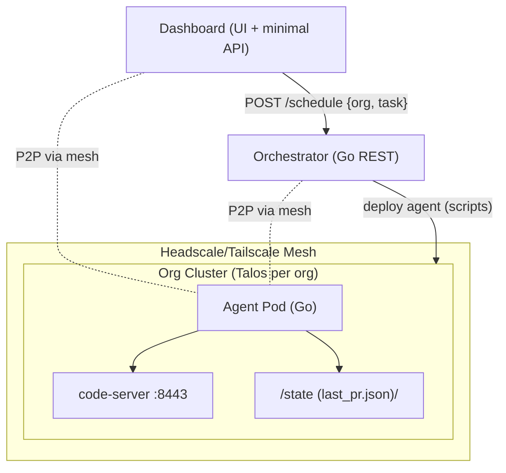

# Architecture Overview

This document captures the current MVP architecture at a high level: the core components, how they interact, and the main request/flow traces. It stays intentionally simple while reflecting the latest system behavior.

## System context

- Orchestrator (Go)
  - Lightweight control plane with a REST API.
  - Tracks tasks and agents in memory (MVP) and coordinates deployments to org clusters via scripts.
  - Peers with other orchestrators in the future.
- Dashboard (Node/Express + SPA)
  - Web UI for operators and a minimal server for health/state and commands.
  - Proxies/sends scheduling requests to the Orchestrator.
- Agent (Go + code-server)
  - Runs inside each organization’s Kubernetes cluster.
  - Pulls context, executes a task stub, and exposes an editor (code-server) on port 8443.
  - Emits stub artifacts (e.g., last_pr.json) into a shared state path.
- Mesh (Headscale/Tailscale)
  - Provides secure peer-to-peer connectivity between local/dev services and cluster-resident agents.
  - Uses a local Headscale controller and the Tailscale Operator for K8s when applicable.
- Clusters (Talos per organization)
  - Each org has its own Talos-managed Kubernetes cluster.
  - Agents are deployed on a per-org basis.

## Component diagram

## Request/flow traces

- Health checks
  - Orchestrator exposes GET /health
  - Dashboard exposes GET /api/health
- Schedule task (MVP path)
  - Dashboard sends schedule request to Orchestrator (e.g., POST /schedule with { org, task })
  - Orchestrator accepts, records task in memory, returns 202 with agent/cluster hint
  - A script/operator deploys the Agent into the target org’s cluster
- Agent lifecycle (MVP)
  - Agent pod starts in the org cluster
  - Agent pulls context and runs a task stub
  - Agent exposes code-server on :8443 for live editing
  - Agent writes PR/task stub artifacts to /state (e.g., last_pr.json)
- Artifacts surfacing (near-term)
  - Dashboard will surface agent artifacts (e.g., last_pr.json) in subsequent iterations

## Data and configuration

- Organizations
  - Root-level org definitions in orgs.yaml (with orgs.example.yaml as a template)
- Orchestrator
  - Example config at src/configs/agent.example.yaml (agent-side) and orchestrator configs under orchestrator/configs
- Dashboard
  - Certs for local TLS in src/dashboard/certs (used for dev/test)
  - Minimal transient state under ./state (e.g., dashboard.db during dev/tests)
- Agent
  - Writes state/artifacts under /state inside the environment
  - Integrates with code-server scripts in src/agent/app/code_server

## Networking and security (MVP)

- Mesh
  - Headscale (local) and Tailscale provide secure overlay networking
  - Tailscale Operator can expose in-cluster services via Tailscale
- Editor access
  - Agent’s code-server runs on port 8443 inside the cluster; exposure is via the mesh or K8s Service as configured
- Certificates
  - The Dashboard’s dev server can use self-signed certs from src/dashboard/certs
- AuthZ/AuthN
  - Not yet implemented; planned for future iterations

## What’s in place vs. what’s next

- In place (MVP)
  - Orchestrator REST API and in-memory task/agent tracking
  - Dashboard UI + minimal API, end-to-end scheduling via Orchestrator
  - Script-driven Agent deployment to Talos org clusters
  - Agent task stubs, context pulling stubs, and code-server on :8443
  - Headscale/Tailscale integration scripts and Talos bootstrap scripts
- Next
  - Replace script-driven scheduling with direct Orchestrator→K8s integration
  - Persist tasks/agents and artifacts (beyond in-memory + ad-hoc files)
  - Add authentication, RBAC, and peer lifecycle management
  - Enrich artifact surfacing in the Dashboard (e.g., last PR, logs, status)
