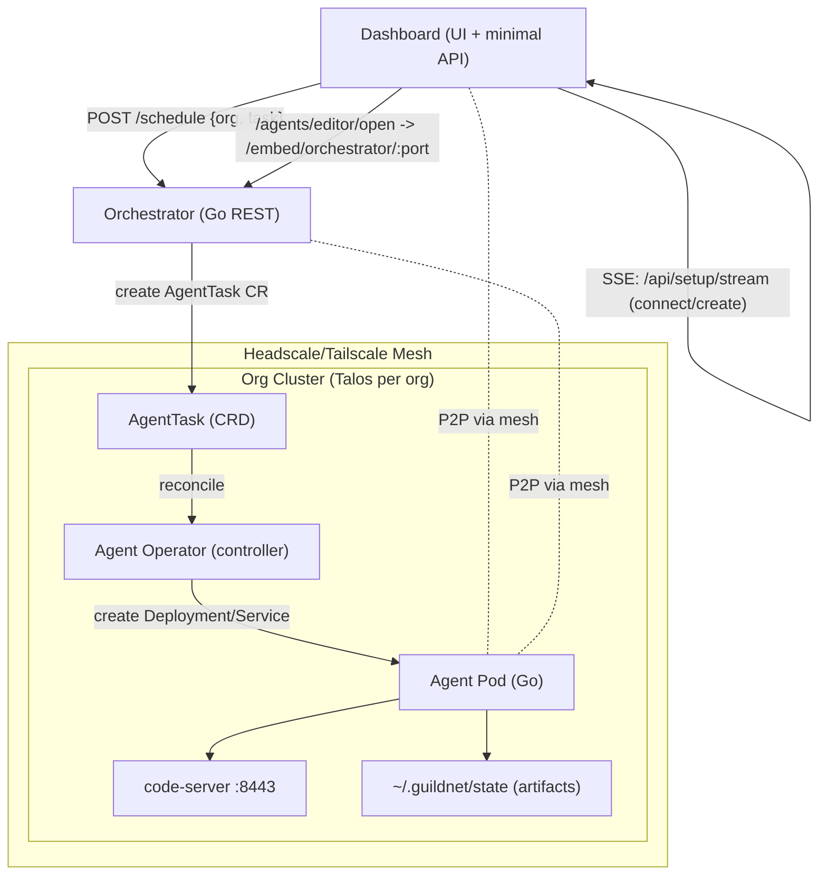
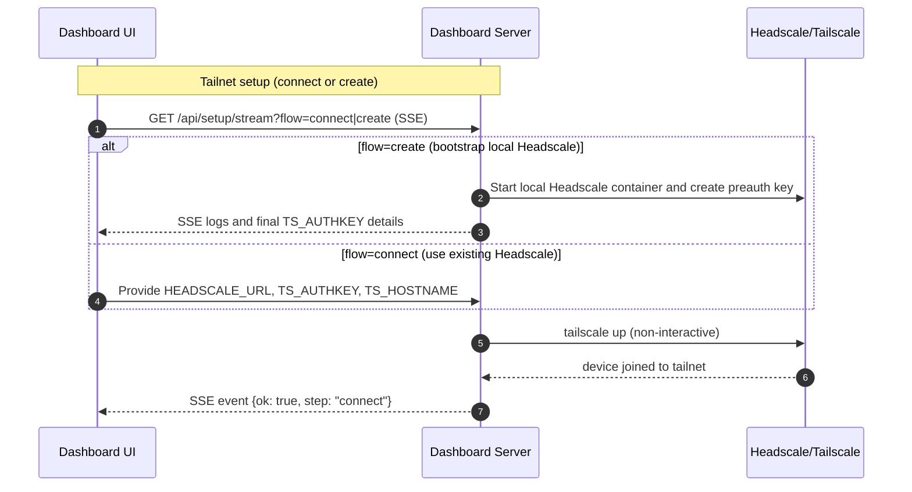
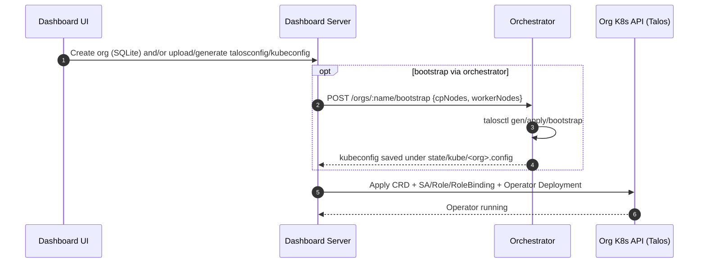
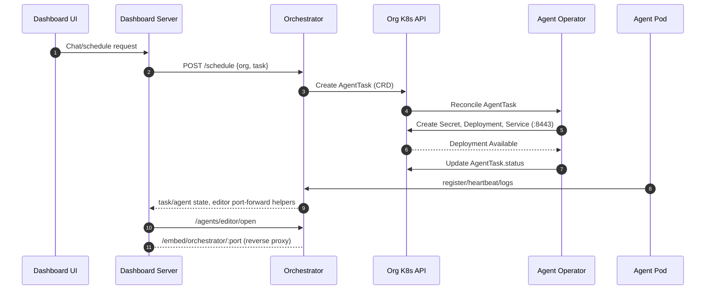

# Architecture Overview

Updated: 2025-10-04

This document captures the current architecture at a high level: the core components, how they interact, and the main request/flow traces. It reflects the current distributed-only design (no local/stub modes). The Dashboard drives setup and orchestration, the Orchestrator manages scheduling and cluster interactions, and per-org clusters run Agents managed through a Kubernetes Operator and CRD.

## System context

- Dashboard (Node/Express + SPA)
  - Web UI and minimal API server (TypeScript/Express, HTTPS in dev).
  - Handles initial setup via Server-Sent Events (SSE) at `/api/setup/stream` for connect/create flows.
  - Proxies orchestration calls and embeds editor access via reverse proxies.
- Orchestrator (Go)
  - Lightweight control plane with a REST API and health endpoint.
  - Tracks tasks/agents in memory (MVP) and can submit AgentTask Custom Resources to org clusters (CRD path).
  - Provides helper endpoints for editor port-forwarding and cluster interactions.
- Agent (Go + code-server)
  - Runs inside each organization’s Kubernetes cluster.
  - Created and managed by the Operator in response to AgentTask CRs.
  - Pulls context, executes work, emits artifacts, and exposes code-server on port 8443.
- Operator + CRD (Kubernetes)
  - AgentTask CRD models a unit of agent work; an Operator reconciles CRs into Deployments/Services.
  - Deployed per org cluster; operator manifests and wiring exist in this repo.
- Mesh (Headscale/Tailscale)
  - Secure overlay network between local/dev services and cluster agents.
  - Local Headscale controller supported; tailscale CLI used for device join. Tailscale Operator is optional.
- Clusters (Talos per organization)
  - Each org has a Talos-managed Kubernetes cluster.
  - Kubeconfig and talosconfig are generated/written under the shared state directory per org.

## Component diagram

## Detailed flows (sequence diagrams)

### Tailnet setup: connect vs create

### Cluster bootstrap (per org)

### Schedule and reconcile a task (CRD path)

## Request/flow traces

- Health checks
  - Orchestrator: `GET /health`
  - Dashboard: `GET /api/health`
- Setup (SSE)
  - `GET /api/setup/stream?flow=connect|create` streams step logs/events.
  - Connect flow: joins tailnet using provided `HEADSCALE_URL`, `TS_AUTHKEY`, `TS_HOSTNAME`.
  - Create flow: can bootstrap local Headscale and generate an auth key (optional, environment-dependent).
- Bootstrap org cluster (optional via Orchestrator)
  - `POST /orgs/:name/bootstrap { cpNodes, workerNodes }` performs Talos gen/apply/bootstrap and writes kubeconfig under state.
- Schedule task (CRD path)
  - Dashboard sends schedule request to Orchestrator: `POST /schedule { org, task }`.
  - Orchestrator creates an AgentTask CR in the org cluster; Operator reconciles into Secret/Deployment/Service and updates status.
- Editor access
  - Dashboard calls Orchestrator to ensure a kubectl port-forward; Dashboard reverse-proxies `/embed/orchestrator/:port/*` for in-browser code-server.

## Data and configuration

- Organizations
  - Orgs are managed by the Dashboard (SQLite) and associated configs (Talos/kube) live under the shared state dir.
  - Generated kubeconfigs: `~/.guildnet/state/kube/<org>.config`
  - Generated talosconfigs: `~/.guildnet/state/talos/<org>.talosconfig`
- Orchestrator
  - Configs under `src/orchestrator/configs`; images include `talosctl` and `kubectl`.
  - Agents receive env via Operator-provisioned Secret (`ORCHESTRATOR_URL`, `ORCHESTRATOR_TOKEN`, etc.).
- Dashboard
  - Dev TLS certs under `src/dashboard/certs`.
  - Database: `~/.guildnet/state/dashboard.db`.
- Agent
  - Writes artifacts under `~/.guildnet/state` and serves code-server on 8443.

### State directories and environment

- Base state dir resolution (for both Dashboard and Orchestrator):
  - If `GUILDNET_STATE_DIR` is set, use it.
  - Else if `GUILDNET_HOME` is set, use `${GUILDNET_HOME}/state`.
  - Else if `GUILDNET_ENV=dev`, default to `~/.guildnetdev/state`; otherwise `~/.guildnet/state`.
  - Dashboard DB: `${state}/dashboard.db`
  - Kubeconfigs per org: `${state}/kube/<org>.config`
  - Talos configs per org: `${state}/talos/<org>.talosconfig`

## Networking and security

- Mesh
  - Headscale (local) and Tailscale provide secure overlay networking.
  - Optional Tailscale Operator to expose in-cluster Services on the tailnet.
- SSE and reverse proxies
  - Setup uses SSE over `GET /api/setup/stream`.
  - Bootstrap proxy fix: Dashboard forwards upstream status codes (no more masked 502s).
  - Editor embedding via Orchestrator port-forward is proxied under `/embed/orchestrator/:port/*`.
- Certificates
  - The Dashboard dev server uses self-signed certs under `src/dashboard/certs`.
- AuthZ/AuthN
  - Token-based auth between Dashboard and Orchestrator; RBAC within clusters via Operator service account.
  - Agents need a reachable `ORCHESTRATOR_URL` (ideally a tailscale-reachable `PUBLIC_ORCHESTRATOR_URL`).

## Testing and developer experience

- Unit/E2E tests live under `src/dashboard/server/*.test.ts` and are gated by environment variables for network-heavy tests.
- SSE setup tests can target a running Dashboard via `DASHBOARD_URL_TEST`; tailscale/headscale tests are gated by `RUN_TAILSCALE_E2E`.
- Fast mode has been removed; tests run the non-fast path.
- VS Code tasks provided to build/test Orchestrator and Dashboard.

## Status checklist: what works and what’s next

The following reflects the current state validated as of 2025-10-04.

### Works today

- Build and health
  - Orchestrator builds and passes unit tests; health endpoint responds OK.
  - Dashboard server runs in dev (HTTPS) and responds OK on `/api/health`.
- Setup and mesh
  - SSE `/api/setup/stream` supports GET; connect flow successfully joins tailnet with provided `HEADSCALE_URL`/`TS_AUTHKEY`/`TS_HOSTNAME`.
  - Local Headscale helper can bootstrap and generate a preauth key (create flow), environment-dependent.
- Org configs
  - Per-org talosconfig and kubeconfig generation/writing under the shared state directory.
  - `GET /api/orgs` lists orgs from SQLite; create/delete org endpoints wired.
- Scheduling (CRD path)
  - `POST /schedule { org, task }` from Dashboard to Orchestrator creates AgentTask CR (manifests present).
  - Operator manifests are applied by Dashboard; basic wiring in place for reconciliation.
- Editor access
  - Orchestrator can open kubectl port-forwards; Dashboard proxies `/embed/orchestrator/:port/*` to reach in-cluster code-server on 8443.
- Proxy correctness
  - Org bootstrap proxy forwards upstream 4xx/5xx verbatim (no masked 502); unit tests cover this.

### Known gaps and next steps

- Create flow prerequisites
  - Current create flow expects discoverable control-plane nodes; when none are found, bootstrap fails. Next: allow explicit CP_NODES/WORKER_NODES input via UI/API and/or improve discovery via tailscale.
- Operator and images
  - Build/publish Operator and Agent images to a registry; wire imagePullSecrets if private; ensure clusters can pull images.
- Headscale automation in UI
  - Optional: manage tailnets and preauth keys from the Dashboard to remove manual steps.
- Public orchestrator URL
  - Standardize `PUBLIC_ORCHESTRATOR_URL` advertisement on the tailnet for Agents to call back reliably.
- Persistence and surfacing
  - Persist tasks/agents/logs beyond in-memory; surface artifacts (e.g., PR metadata) and logs in the Dashboard.
- Observability and UX
  - Stream logs/events for tasks; improve error messaging in SSE and API responses; add progress indicators in UI.
- Security hardening
  - Token management/rotation, TLS for inter-service calls where applicable, and refined cluster RBAC.
- E2E coverage
  - Expand integration tests for create flow (with real CP/WK nodes), operator reconciliation, and editor access over tailscale.

### Nice-to-haves (future)

- Adopt Tailscale Operator to expose Services directly on the tailnet (remove port-forward dependency).
- Multi-org dashboards, quotas, and org isolation helpers.
- Pluggable task types, artifacts browser, and richer agent telemetry.

## Glossary

- Dashboard: UI + Express server in `src/dashboard`.
- Orchestrator: Go service in `src/orchestrator/app`.
- Agent: Work-executing pod with code-server, managed per org.
- Operator: Kubernetes controller that reconciles AgentTask CRs.
- AgentTask (CRD): Custom resource representing a schedulable agent task.
- Headscale/Tailscale: Mesh networking components for secure connectivity.
