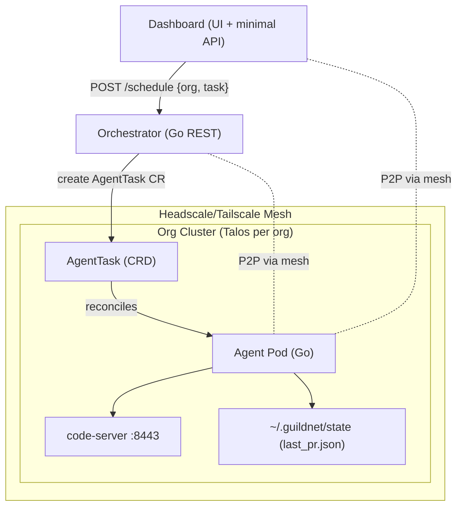

# Architecture Overview

This document captures the current architecture at a high level: the core components, how they interact, and the main request/flow traces. It reflects the CRD/operator-only design.

## System context

- Orchestrator (Go)
  - Lightweight control plane with a REST API.
  - Tracks tasks and agents in memory (MVP) and submits AgentTask Custom Resources to org clusters.
  - No imperative/script deployments; the Operator owns reconciliation.
- Dashboard (Node/Express + SPA)
  - Web UI for operators and a minimal server for health/state and commands.
  - Proxies/sends scheduling requests to the Orchestrator.
- Agent (Go + code-server)
  - Runs inside each organization’s Kubernetes cluster.
  - Created and managed by the Operator in response to AgentTask CRs.
  - Pulls context, executes work, and exposes an editor (code-server) on port 8443.
  - Emits artifacts (e.g., last_pr.json) into a shared state path.
- Mesh (Headscale/Tailscale)
  - Provides secure peer-to-peer connectivity between local/dev services and cluster-resident agents.
  - Uses a local Headscale controller and the Tailscale Operator for K8s when applicable.
- Clusters (Talos per organization)
  - Each org has its own Talos-managed Kubernetes cluster.
  - Agents are deployed on a per-org basis.

## Component diagram



## Request/flow traces

- Health checks
  - Orchestrator exposes GET /health
  - Dashboard exposes GET /api/health
- Schedule task (CRD path)
  - Dashboard sends schedule request to Orchestrator (POST /schedule with { org, task })
  - Orchestrator accepts, records task in memory, and creates an AgentTask CR in the org cluster
  - The Operator reconciles the CR: creates Secret/Deployment/Service for the Agent and sets status/conditions
- Agent lifecycle
  - Agent pod starts in the org cluster
  - Agent pulls context and runs task-specific logic
  - Agent exposes code-server on :8443 for live editing
  - Agent writes artifacts to ~/.guildnet/state (e.g., last_pr.json)
- Artifacts surfacing
  - Dashboard surfaces agent artifacts and status where available

## Data and configuration

- Organizations
  - Org configuration is generated via the Dashboard and Orchestrator through the UI.
  - No hardcoded `orgs.yaml` is required in the repo; an optional `orgs.example.yaml` illustrates the shape.
  - Generated kubeconfigs are written under `~/.guildnet/state/kube/<org>.config` for internal use.
- Orchestrator
  - Example config at src/configs/agent.example.yaml (agent-side) and orchestrator configs under orchestrator/configs
- Dashboard
  - Certs for local TLS in src/dashboard/certs (used for dev/test)
  - Minimal state under ~/.guildnet/state (e.g., dashboard.db, kube/talos configs)
- Agent
  - Writes state/artifacts under ~/.guildnet/state inside the environment
  - Exposes code-server on port 8443 via a Service; the Orchestrator can port-forward for browser access

## Networking and security

- Mesh
  - Headscale (local) and Tailscale provide secure overlay networking
  - Tailscale Operator can expose in-cluster services via Tailscale
- Editor access
  - Agent’s code-server runs on port 8443 inside the cluster; exposure is via the mesh or K8s Service as configured
- Certificates
  - The Dashboard’s dev server can use self-signed certs from src/dashboard/certs
- AuthZ/AuthN
  - Token-based auth between Dashboard and Orchestrator; RBAC within clusters via Operator service account

## What’s in place vs. what’s next

- In place
  - Orchestrator REST API and in-memory task/agent tracking
  - Dashboard UI + minimal API, end-to-end scheduling via Orchestrator
  - CRD/operator flow: AgentTask CRD and per-cluster Operator manage agents
  - Agent stubs, context pulling stubs, and code-server on :8443
  - Headscale/Tailscale integration scripts and Talos bootstrap scripts
- Next
  - Persist tasks/agents and artifacts (beyond in-memory + ad-hoc files)
  - Add authentication, RBAC, and peer lifecycle management
  - Enrich artifact surfacing in the Dashboard (e.g., last PR, logs, status)

```

```
